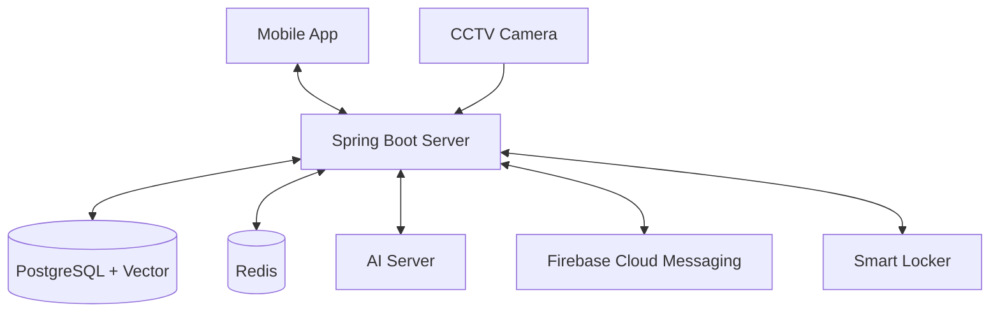

# Zoopick Server

Zoopick은 AI 기반의 유실물 관리 및 매칭 시스템입니다. 
CCTV 영상을 분석하여 분실물을 자동으로 감지하고, 유저가 등록한 분실물 게시글과 매칭하여 스마트 사물함을 통해 안전하게 물품을 찾을 수 있도록 돕는 통합 솔루션입니다.

---

## 목차
- [주요 기능](#-주요-기능)
- [기술 스택](#-기술-스택)
- [시스템 아키텍처](#-시스템-아키텍처)
- [사전 요구 사항](#-사전-요구-사항)
- [설치 및 설정](#-설치-및-설정)
- [실행 방법](#-실행-방법)
- [API 문서](#-api-문서)
- [프로젝트 구조](#-프로젝트-구조)

---

## 주요 기능

- **AI 유실물 탐지**: CCTV 영상을 분석하여 물품의 종류, 색상 등을 추출하고 데이터베이스에 저장합니다.
- **지능형 매칭 시스템**: 유저가 등록한 분실물 정보와 AI가 탐지한 물품 정보를 비교하여 가장 유사한 물품을 추천합니다. (Hibernate Vector 활용)
- **IoT 스마트 사물함 연동**: 매칭된 물품을 스마트 사물함에 보관하고, QR 코드를 통해 비대면으로 물품을 수령할 수 있습니다.
- **실시간 채팅 및 알림**: 습득자와 분실자 간의 실시간 채팅(WebSocket) 및 중요 이벤트 발생 시 푸시 알림(FCM)을 제공합니다.
- **시간표 기반 위치 추정**: 유저의 시간표 데이터를 활용하여 분실 가능성이 높은 장소와 시간을 추정합니다.

---

## 🛠 기술 스택

### Backend
- **Framework**: Spring Boot 3.4.1 (Java 17)
- **Database**: PostgreSQL (Hibernate Vector 지원)
- **Caching/Queue**: Redis (인증번호 관리, 실시간 알림 큐 등)
- **Security**: Spring Security, JWT (JSON Web Token)
- **Messaging**: WebSocket (STOMP), Firebase Cloud Messaging (FCM)
- **Documentation**: Springdoc OpenAPI (Swagger UI)

### AI & IoT (External)
- **AI Server**: FastAPI (YOLO 및 임베딩 추출 모델)
- **IoT**: ESP32 기반 스마트 사물함 제어

---

## 시스템 


---

## 사전 요구 사항

- **Java 17** 이상
- **PostgreSQL 16** 이상 (Vector 확장팩 설치 권장)
- **Redis**
- **Firebase Admin SDK** 서비스 계정 키 (.json 파일)

---

## 설치 및 설정

### 1. 환경 변수 설정
프로젝트 루트에 `.env` 파일을 생성하고 아래 내용을 설정합니다.

```properties
# Database 설정
SPRING_DATASOURCE_URL=jdbc:postgresql://localhost:5432/zoopick
SPRING_DATASOURCE_USERNAME=your_username
SPRING_DATASOURCE_PASSWORD=your_password

# Mail 설정 (인증용)
SPRING_MAIL_USERNAME=your_email@gmail.com
SPRING_MAIL_PASSWORD=your_app_password

# Security 설정
JWT_SECRET=your_jwt_secret_key_at_least_32_characters

# 외부 연동 설정
FIREBASE_ACCOUNT_KEY_PATH=path/to/firebase-adminsdk.json
FASTAPI_BASE_URL=http://your-ai-server-url
```

### 2. 데이터베이스 초기화
제공된 `zoopick_dump.sql` 파일을 사용하여 데이터베이스를 초기화할 수 있습니다.

```bash
# 데이터베이스 생성
createdb -U postgres zoopick

# 덤프 파일 복구
psql -U postgres -d zoopick -f zoopick_dump.sql
```

---

## 실행 방법

### 빌드
```bash
./mvnw clean package
```

### 실행
```bash
java -jar target/zoopick-server-0.0.1.jar
```

---

## API 문서

서버 실행 후 브라우저에서 아래 주소로 접속하여 API 명세를 확인할 수 있습니다.
- **Swagger UI**: `http://localhost:8080/swagger-ui/index.html`

---

## 프로젝트 구조

```text
src/main/java/com/zoopick/server/
├── config/          # 애플리케이션 설정 (Security, Redis, Swagger 등)
├── controller/      # API 엔드포인트
├── dto/             # 데이터 전송 객체
├── entity/          # JPA 엔티티 (DB 모델)
├── repository/      # 데이터 액세스 계층 (Spring Data JPA)
├── service/         # 비즈니스 로직
├── websocket/       # 실시간 채팅 관련 로직
└── ZoopickApplication.java  # 메인 애플리케이션 클래스
```
